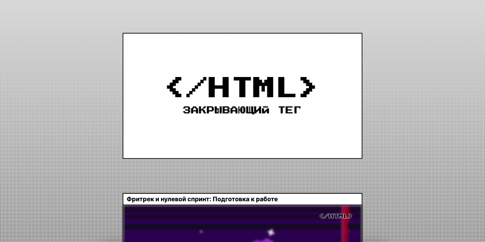

# Закрывающий тег

## Описание

Проект «Закрывающий тег» — это одностраничный сайт, оформленный в виде карточек с описаниями этапов прохождения блока курса «Вёрстка»

## Стек технологий 

* HTML
* CSS
* JavaScript
* Анимации 
* Адаптивность 
* Функции 

### Деплой на GitHub

https://maksim533.github.io/zakrivayuschiy-teg-f/